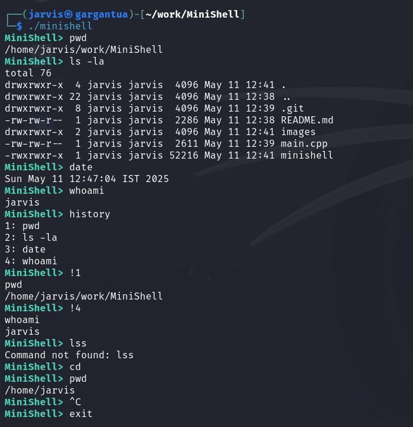

# 🐚 MiniShell - A Basic Linux Shell in C++

## 📜 About
- MiniShell is a simple Linux shell written in C++.
- It supports running basic commands, handling directory changes (cd), and keeps a simple command history.
- This project was built to deepen my understanding of system calls (fork(), execvp(), wait()) and Linux internals.

## 🚀 Features
- **Run standard Linux commands :** Supports external commands like ls, pwd, date, echo, etc. using execvp

- **Prompt Display :** Colored Prompt using ANSI escape codes

- **`cd` command :**  to change directories using chdir()

- **Exit Command :** `exit` terminates the shell loop

- **History Command :** Keeps a maximum of 50 commands, trimming the oldest

- **Execute Commands from History :** Supports `!N` to execute the N-th command in history

- **Basic error handling :** Prints user-friendly messages when fork() or execvp() fail
  
- **Signal Handling :** Gracefully handles `Ctrl+C` without exiting the shell

## 🔧 Technologies Used
- C++

- Linux System Programming (fork, execvp, wait, chdir)

- GCC Compiler

- Git for version control

## 🛠️ How to Build and Run
### Clone the repository:
```bash
git clone https://github.com/qwerty-arun/MiniShell.git
cd MiniShell
```

### Compile the project:
```bash
g++ main.cpp -o minishell
```

### Run the shell:
```bash
./minishell
```
## 📸 Demo

## 📚 What I Learned
- How Linux creates and manages processes.

- How command execution actually works under the hood.

- Handling user input and system calls properly.

- Building real-world C++ projects.

## 🤔 Future Improvements
- [x] Add support for piping (|) and redirection (>, <)

- [x] Handle Command Chaining (&&, || and ;)

- [ ] Implement tab-autocomplete for commands

- [ ] `alias` command
      
- [ ] Job Control: implement `fg`, `bg` and `jobs` commands
      
- [ ] Support Environment Variables

- [ ] Supporting background execution using '&'

## 🧑‍💻 Author
### Arun K R
### [LinkedIn](https://www.linkedin.com/in/arun-k-r-3706a525b/)
### [GitHub](https://github.com/qwerty-arun)
